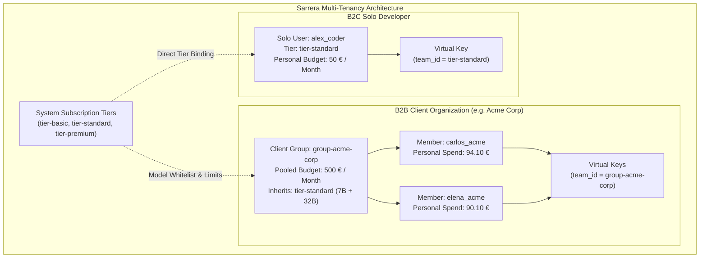

# Tenancy Models: Client Groups & Solo Developers

Sarrera provides a dual-tenancy governance architecture designed to support both **B2B Enterprise Client Accounts** (with pooled token budgets and multi-seat access) and **B2C Solo Developers** (with individual subscription tiers and personal budgets).

---

## 1. Commercial & Governance Models



### Model A: B2B Client Groups (Corporate Multi-Seat)
- **Target Audience**: Corporate clients, engineering departments, digital agencies, enterprise teams.
- **Pooled Monthly Budget**: A single corporate spend cap (e.g. €500.00 / month) shared across all enrolled team members.
- **Model Whitelist Inheritance**: The group binds to a base system tier (e.g. `tier-standard`), granting access to all tier models (`basic-coder`, `premium-coder`) without managing models individually per seat.
- **Dual-Level Telemetry & Invoicing**:
  - **Consolidated Monthly Invoice**: Billed to the client entity based on total `group.spend`.
  - **Member-Level Audit**: Sub-accounting per developer seat allows corporate admins to monitor individual consumption and perform internal chargebacks.

### Model B: B2C Solo Developers (Individual Accounts)
- **Target Audience**: Freelancers, contractors, individual engineers.
- **Personal Quota**: Directly bound to a system tier (`tier-basic`, `tier-standard`, `tier-premium`) with an individual monthly spending cap (e.g. €15, €50, or €100).
- **Direct Invoicing**: Billed directly per developer based on their personal `user.spend`.

---

## 2. Managing Client Groups via Web Portal

The **Sarrera Service Portal** provides a dedicated multi-tab governance hub under **Tenancy, Groups & User Directory**:

### Tab 1: Client Groups (B2B)
- **KPI Metrics Banner**: Real-time display of active corporate groups, total pooled allocated budgets, consolidated group spend, and enrolled seats.
- **Group Cards & Progress Bars**:
  - Corporate Client Name, Slug ID (`group-<slug>`), Base Tier badge, and Contact Email.
  - Consolidated Budget Consumption bar (`€ Spend / € Max Budget`, `% used`).
  - Active rate limits (RPM / TPM).
- **Enrolled Seats Table**:
  - Lists every enrolled engineer with their role (`admin` or `user`) and individual token spend.
  - One-click actions: "+ Add Member", "Issue Group Key", "Issue Member Key", and "Remove Member".
- **Modal "+ Create Client Group"**:
  - **Group Slug / Identifier**: e.g., `acme-corp` (automatically prefixed with `group-`).
  - **Company / Organization Name**: e.g., `Acme Corporation Enterprise`.
  - **Billing Contact Email**: e.g., `billing@acme.com`.
  - **Base Tier**: Determines model access (`tier-basic`, `tier-standard`, `tier-premium`).
  - **Pooled Monthly Budget Cap**: Monthly token limit in EUR.

### Tab 2: Solo Developers (B2C)
- Lists independent engineers with their personal subscription tier, monthly spend progress bar, active keys, and key issuance actions.

### Tab 3: All Users Directory
- Global searchable directory of all engineering staff.
- Account classification badges clearly distinguish `[🏢 Acme Corp Member]` from `[👤 Solo Developer]`.

### Tab 4: Billing & Consumption Rollup
- Executive financial summary showing:
  - **B2B Corporate Invoiced Volume**: Total spend billed to corporate group entities.
  - **B2C Solo Invoiced Volume**: Total spend billed to individual developers.
  - **Total Platform Revenue / Spend**: Consolidated billing metric.
  - Dedicated breakdown tables for each commercial category with quota health status.

---

## 3. Provisioning Groups via CLI (`scripts/create-group.sh`)

For CI/CD automation, Terraform, or terminal workflows, Sarrera includes the `create-group.sh` utility:

```bash
# Provision an Enterprise Client Group with Standard Tier models and 500 EUR budget:
./scripts/create-group.sh \
  -i acme-corp \
  -n "Acme Corporation Enterprise" \
  -t tier-standard \
  -b 500.00 \
  -e billing@acme.com

# Provision a High-Performance Premium Group with DeepSeek-R1 reasoning:
./scripts/create-group.sh \
  -i fintech-labs \
  -n "FinTech Quantitative Labs" \
  -t tier-premium \
  -b 1500.00 \
  -e finance@fintechlabs.io
```

### CLI Options Reference
| Flag | Long Option | Description | Default |
| :--- | :--- | :--- | :--- |
| `-i` | `--id` | Unique group identifier (slug) | Required (prompted) |
| `-n` | `--name` | Corporate client name | Required (prompted) |
| `-t` | `--tier` | Base tier (`tier-basic`, `tier-standard`, `tier-premium`) | `tier-standard` |
| `-b` | `--budget` | Monthly pooled budget cap in EUR | `500.0` |
| `-e` | `--email` | Corporate billing contact email | Optional |
| `-r` | `--rpm` | Requests per minute rate limit | `120` (or tier default) |

---

## 4. Issuing Keys for Group Members

When issuing a virtual API key for a developer enrolled in a group, set the `team_id` to the corporate group identifier (`group-<id>`):

```bash
# Issue an API key for Carlos under Acme Corp:
./scripts/issue-key.sh carlos_acme group-acme-corp 90d "Acme Engineering"
```

The resulting key routes all token consumption to:
1. `carlos_acme`'s individual developer spend in LiteLLM and Langfuse.
2. `group-acme-corp`'s pooled monthly corporate budget cap.

---

## 5. Developer Workspace Experience

When an engineer signs in to the Sarrera Developer Workspace (`/developer`) with their virtual key:
- **Corporate Affiliation Badge**: The header indicates `🏢 Enterprise Member · ACME CORPORATION`.
- **Dual Quota Display**:
  - **Individual Token Spend Card**: Shows their personal spend against their individual sub-cap.
  - **Group Pooled Budget Card**: Displays real-time progress of the group's pooled quota (`184.20 € / 500.00 € (36% used)`).
  - **Rate Limits Card**: Displays their allocated RPM and TPM throughput.

---

## 6. Per-User Quota Source Switch

> [!NOTE]
> **Available since v1.3.0.**

Each group member can consume either the **group's pooled budget** or a **fixed individual quota**:

| Mode | LiteLLM `User.max_budget` | Effective ceiling |
| :--- | :--- | :--- |
| **Group pool** (`Consumir de la Bolsa del Grupo`) | `null` | Only the group's `Team.max_budget` |
| **Individual quota** (`Cuota Individual Fija`) | fixed value (e.g. `50.0`) | Whichever is hit first: the user's cap **or** the group pool |

LiteLLM always enforces both ceilings (dual-ceiling governance): an individual quota never lets a user exceed the group pool, it only limits their share of it.

**Where to toggle:**
- In the **Onboard User** dialog (switch before creating the user).
- In the **Solo Users**, **All Users Directory** and **Group Members** tables via the quota-source pill on each row.
